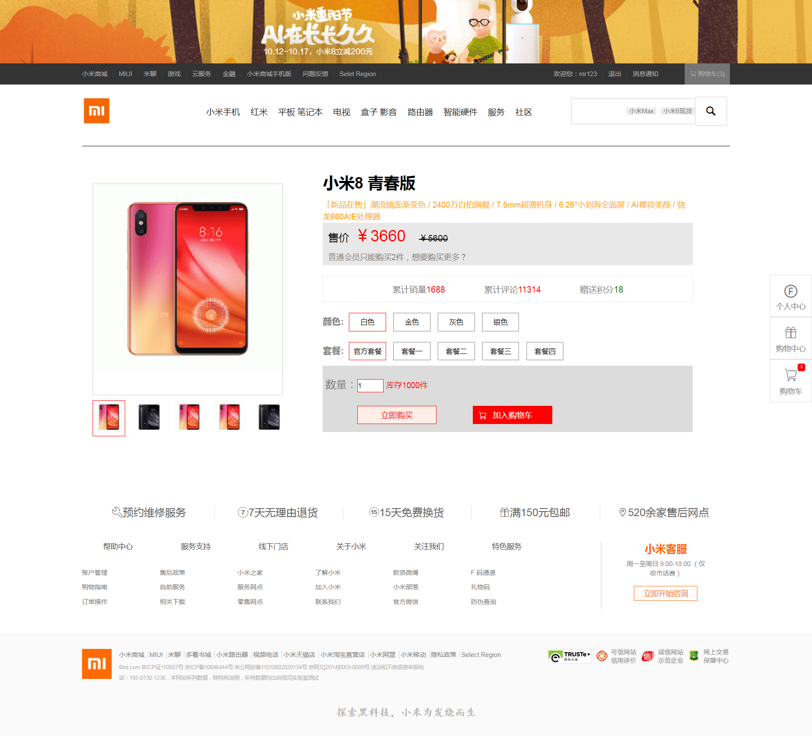
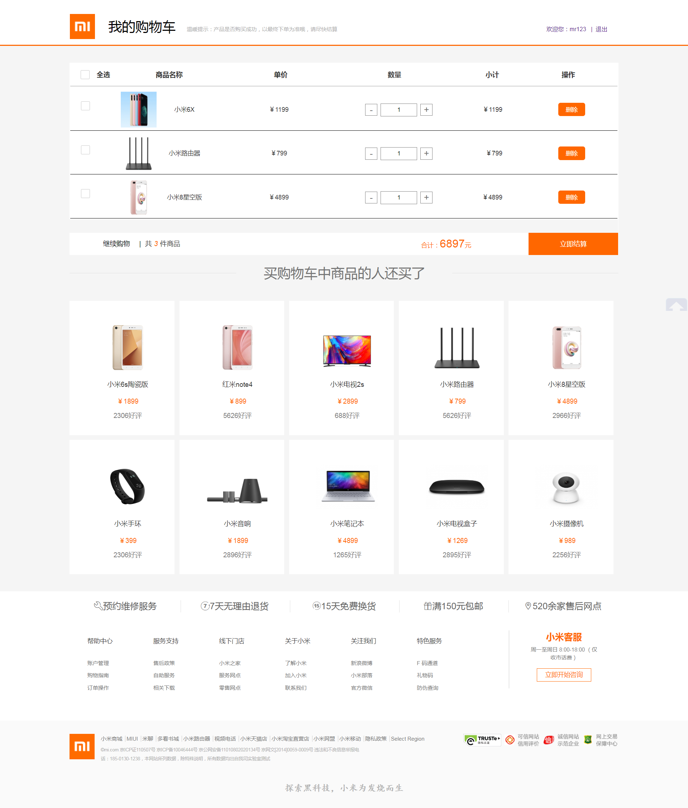
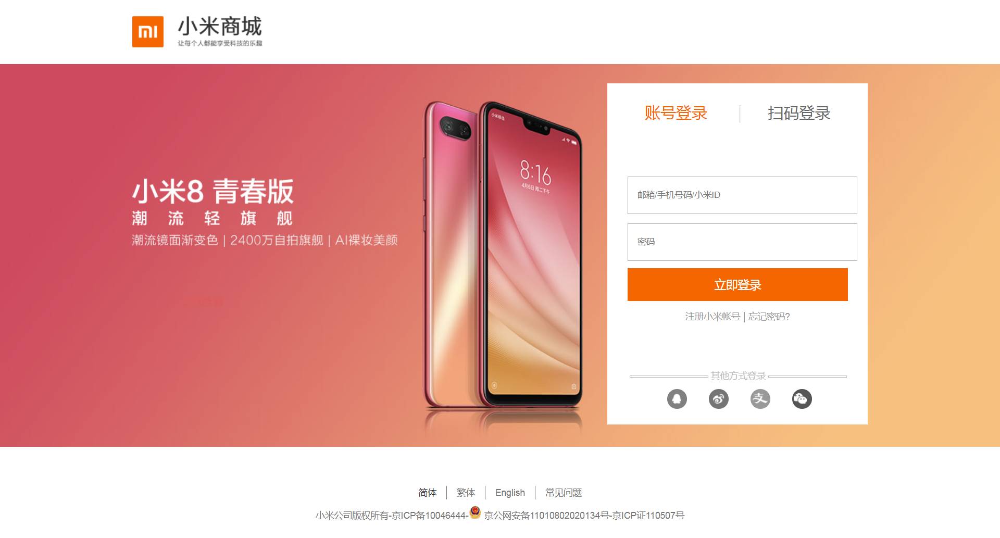

# mi-shop
完整小米商城（不进行压缩）
# mi gulp压缩版
前往小米项目gulp压缩版[gulp压缩版](https://github.com/zhongyoufeng/mi "mi")
# v1.0
完成项目静态网页设计，html+css测试通过
# v2.0
完成项目动态效果交互设计，如：动态改变商品详情页，轮播图，放大镜，拖拽，提示框，下拉菜单等等。html+css+js测试通过
# v3.0
完成项目页面动态渲染，购物车设计测试通过
# v4.0
利用localstorage，cookie技术等完成登陆，注册，验证功能；商品动态加入购物车功能；购物车细节功能实现如：价钱的动态改变，用户操作商品数量等功能，测试通过
# v5.0
完成整个项目的细节修复，细节整理，bug修改等。
# 商品详情展示
#### 详情页，每次点击不同的商品，展示的商品图片，价格，名称等也进行相应的改变。

# 首页展示
#### 首页，首页轮播效果，家电手机的tab切换效果，列表下拉效果等等。用户登录成功后，显示登录的用户名和相应的购物车中商品的数量。

# 购物车
#### 购物车页，用户登录后，可以进行商品的删除、数量的修改、价格也会随之改变，每件商品名称且唯一，不会出现相同的名称在购物车中。购物车页中也有商品可以添加到购物车。并更新总价，和小计价格。

# 购物中心
#### 商品的进入详情页，进行详情页的名称，图片，价格等改变。以及添加到购物车功能。

# 登录注册
#### 登录注册页面，用户名称是唯一的，当有相同的用户名注册时会提示，实现相应的验证功能。

# 技术点总结
 1. 轮播效果
 2. 下拉列表效果
 3. 放大镜效果
 4. localstorage、cookie的灵活运用
 5. 提示框拖拽效果
 6. 加入购物车动画效果
 7. 正则验证
 8. ajax发送请求数据
 9. json动态渲染页面
 .........................

